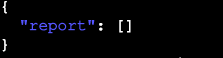

---
## Table of Contents
- [Secure Repo Scanner](#secure-repo-scanner)
- [Project Tree](#project-tree)
- [Features](#features)
- [Technology Stack](#technology-stack)
- [CI/CD and Security](#cicd-and-security)
- [How It Works](#how-it-Works)
- [Running The Project](#running-the-project)
- [API Endpoints](#api-endpoints)
- [DevSecops - Home Assignment - Wix](#devsecops---home-assignment---wix)
---
# Secure Repo Scanner

A Python FastAPI service that scans public GitHub repositories for secret leaks and dangerous code patterns. Designed as a secure, lightweight tool to help identify potential risks in codebases.
---
# Project Tree

```
_
│ - .dockerignore
│ - Dockerfile
│ - README.md
│ - requirements.txt
├───.github
│   └───workflows
│         - ci-cd.yaml
├───app
│     - main.py
│     - scanner.py
├───screenshots
│     - badURL.PNG
│     - CloneFail.PNG
│     - nothingfound.PNG
│     - secretsFound-Linux.PNG
│     - Successes-secrets.PNG
│     - Vun-found.PNG
│     - Vun-found1.PNG
└───tests
      - requirements.txt
      - test_main.py
```


--- 
## Features

- **Secret Scanning**: Detects common secret patterns like API keys and passwords in repository files.
- **Dangerous Code Detection**: Flags usage of risky Python functions such as `eval`, `exec`, and `pickle.load`.
- **Secure Cloning**: Only clones HTTPS GitHub repositories to protect against unsafe inputs.
- **REST API**: Exposes `/scan/secrets` and `/scan/code` endpoints for scanning repositories via JSON requests.

---
## Technology Stack
- **FastAPI** — Modern, high-performance web framework for building APIs with Python.
- **Git** — Clones repositories securely for offline scanning.
- **Regex** — Simple pattern matching for secret and code vulnerability detection.
- **Python** — The core programming language used for developing the backend service.
- **Pytest** — Automated testing framework with detailed test coverage.
- **Docker** — Containerizes the service for consistent deployment.
- **GitHub Actions** — CI/CD pipeline building, scanning, and publishing Docker images securely.
---
## CI/CD and Security

- Automated GitHub Actions workflow builds and tests a Docker image on every push to `main`.
- The Docker image is scanned with [Trivy](https://github.com/aquasecurity/trivy) for known vulnerabilities before publishing.
- Builds fail automatically if critical security issues are detected.
- **Docker credentials and sensitive environment variables are securely stored and managed using GitHub Secrets.**  
  This ensures no sensitive data is hardcoded in the repository or exposed in logs.  
  The CI/CD pipeline retrieves these secrets at runtime to authenticate with container registries and other services.
- The workflow is designed to enforce security best practices and ensure only safe images reach production.

### Vulnerability Scan Example

Below is a sample report image showing critical vulnerabilities detected by Trivy during the build:


---
## How It Works
### This project incorporates several security best practices and design choices to ensure a robust, secure scanner and build pipeline:

* Docker credentials are securely stored in GitHub Secrets.
    All sensitive credentials—such as container registry login tokens—are stored encrypted in GitHub Actions Secrets and injected securely into the workflow at build/runtime. This prevents accidental exposure or hardcoding of secrets in the repository or Dockerfiles.

* Using a non-root user (appuser) inside Docker containers for security.
    The Dockerfile creates and switches to a dedicated user appuser to run the application. This reduces risk by limiting permissions inside the container, following the principle of least privilege.

* Vulnerability reporting step in the CI/CD pipeline.
    During the CI/CD pipeline run, a dedicated step uses Trivy (or similar scanning tools) to analyze the built Docker image for security vulnerabilities.
    It outputs detailed findings of medium and critical severity issues directly to the console logs.
    If critical vulnerabilities are detected, the pipeline fails immediately to prevent pushing insecure images.
    This provides continuous security feedback and enforces high standards before deployment.

* GitHub Workflow Trigger on main Branch
    The CI/CD pipeline is configured to run only when changes are pushed to the main branch of the repository. This is controlled by the workflow trigger configuration in the GitHub Actions file

* Testing the scanner against known vulnerable repositories.
    The scanner was validated on public GitHub repositories known to contain leaked secrets and dangerous code patterns, such as the popular [TruffleHog](https://github.com/trufflesecurity/trufflehog) repo. This ensures the tool is effective in real-world scenarios.

* Using .dockerignore to optimize builds and improve security.
    The project includes a carefully crafted .dockerignore file that excludes unnecessary files and folders.

* Pytest Tests 
  * test_scan_secrets_invalid_url:
    Verifies that the /scan/secrets endpoint correctly rejects invalid repository URLs (e.g., non-HTTPS URLs) by returning an error status.

  * test_scan_code_invalid_url:
    Checks that the /scan/code endpoint properly refuses malformed or unsupported repository URLs, ensuring input validation.

  * test_scan_secrets_success:
    Tests that the /scan/secrets endpoint successfully scans a valid public GitHub repository, returning a JSON report containing a "report" field.

  * test_scan_code_success:
    Confirms that the /scan/code endpoint correctly processes a valid GitHub repo URL, scanning for dangerous Python code patterns and returning a structured report.  
  

---
## Running The Project

### Run With Docker:
```
docker run -d -p 8000:8000 --name my-secure-scanner guyhemo/devsecops-home-assignment:latest
```

#### OR

### Run locally
####  Install the project dependencies:
```
pip install -r requirements.txt
```

#### Run Application Local:
```
uvicorn app.main:app --host 0.0.0.0 --port 8000
```

### Access via:
```
Secrets Scanner:
http://localhost:8000/scan/secrets

Code Scanner:
http://localhost:8000/scan/code 
```

### Try the Application 

you can use the application using Linux/PowerShell,
the repo url we will use "trufflehog" for this example and use '/scan/secrets' endpoint to scan the repo.

Linux:
```
curl -X POST http://localhost:8000/scan/secrets \
  -H "Content-Type: application/json" \
  -d '{"repo_url":"https://github.com/trufflesecurity/trufflehog"}' | jq 

```


PowerShell:
```

$response = Invoke-RestMethod -Uri 'http://localhost:8000/scan/secrets' `
  -Method POST `
  -Headers @{ "Content-Type" = "application/json" } `
  -Body '{"repo_url":"https://github.com/trufflesecurity/trufflehog"}'
foreach ($item in $response.report) {
    Write-Host "File: $($item.file)"
    foreach ($match in $item.matches) {
        Write-Host "  - Match: $match"
    }
    Write-Host ""
}

```

Example results secrets Found:


when no secrets found it will return empty response.  



Note: if you set bad url you will see:  


### API Endpoints
- **POST /scan/secrets**

  Scan a repo for secrets.
  Request JSON:
  Example Found secrets:
```
  "report": [
    {
      "file": "/tmp/tmpkcrgfdcs/main.go",
      "matches": [
        "AWS_SECRET_ACCESS_KEY"
      ]
    }
```
- **POST /scan/code**
  Scan a repo for code.
  Request JSON:
  Example Found Code:

```
  "report": [
    {
      "file": "/tmp/tmphhh6ayvr/pickle_scanning_benchmark/inject.py",
      "matches": [
        "eval",
        "exec"
      ]
    }
```

---
## DevSecops - Home Assignment - Wix

